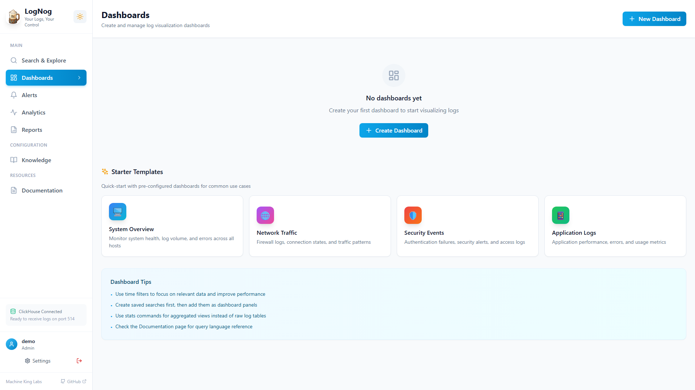
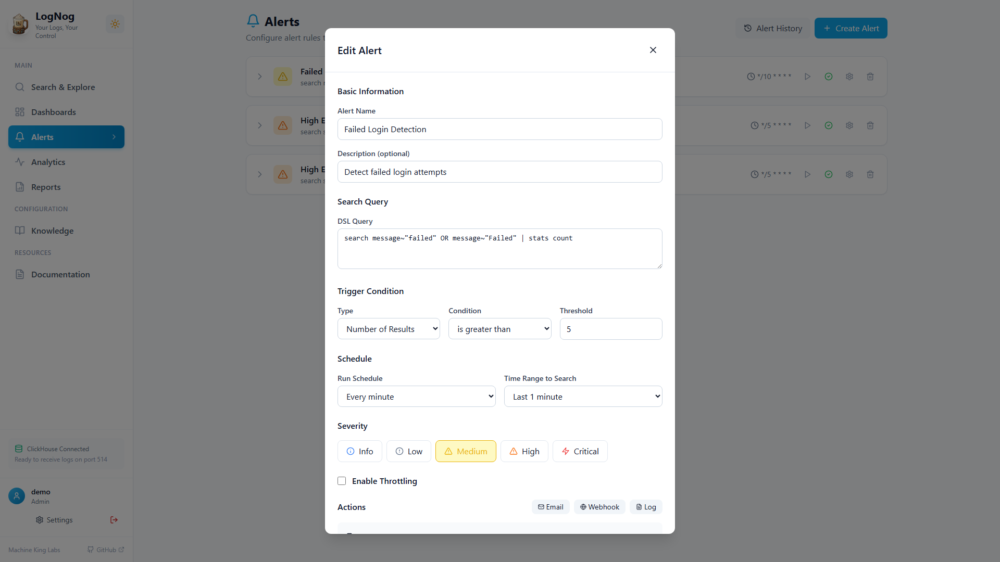
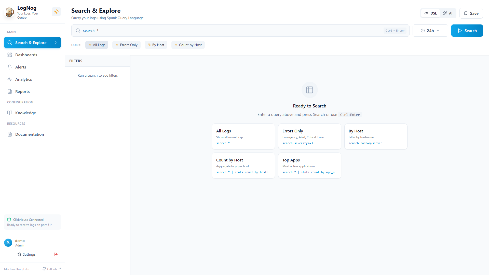

# LogNog

<p align="center">
  
</p>

<p align="center">
  <strong>Your Logs, Your Control</strong><br>
  Self-hosted log management for homelabs and beyond
</p>

<p align="center">
  <a href="#choose-your-setup">Get Started</a> •
  <a href="#features">Features</a> •
  <a href="#query-language">Query Language</a> •
  <a href="#integrations">Integrations</a> •
  <a href="docs/">Documentation</a>
</p>

<p align="center">
  <em>By Machine King Labs</em>
</p>

---

## Why LogNog?

**Splunk lost its way.** What started as a powerful tool for everyone became an enterprise-only product with pricing that locks out homelabbers, small teams, and independent developers. The dev license? A joke.

**LogNog is different:**
- 100% open source (MIT license)
- Runs entirely on your hardware
- No cloud dependencies
- No phone-home telemetry
- No arbitrary limits

---

## How LogNog Compares


| Feature | LogNog | Splunk | ELK Stack | Grafana Loki |
|---------|--------|--------|-----------|--------------|
| **Cost** | Free (MIT) | $$$$ | Free* | Free* |
| **Setup Time** | 10 minutes | Hours | Hours | 30+ min |
| **Query Language** | Splunk-like DSL | SPL | Lucene/KQL | LogQL |
| **Learning Curve** | Low | High | Medium | Medium |
| **Single Binary** | Yes (Lite) | No | No | No |
| **Windows Native** | Yes | Yes | Painful | No |
| **Docker Required** | Optional | No | Yes | Yes |
| **Built-in Alerts** | Yes | Yes | Via Elastalert | Via Grafana |
| **Built-in Dashboards** | Yes | Yes | Via Kibana | Via Grafana |
| **FIM (File Monitoring)** | Yes | Via addon | No | No |
| **Real-time Tail** | Yes (SSE) | Yes | Yes | Yes |
| **GeoIP** | Yes | Yes | Yes | Plugin |
| **Components** | 1-3 | 1 | 3+ (E+L+K) | 3+ (Loki+Promtail+Grafana) |

*ELK and Loki are free but require significant infrastructure and expertise

### Why Not ELK Stack?
- **3 separate systems** to manage (Elasticsearch, Logstash, Kibana)
- **Java-heavy** - high memory usage
- **Complex configuration** - YAML everywhere
- **Lucene query syntax** - different from Splunk SPL

### Why Not Grafana Loki?
- **Designed for metrics first**, logs second
- **LogQL** is different from Splunk SPL
- **Requires Grafana** for visualization
- **No Windows agent** out of the box

### Why LogNog?
- **Splunk-familiar** query language
- **One docker-compose** or native Windows binary
- **Built-in everything** - no separate tools needed
- **AI-ready** - NogBot advisors coming soon

---

## Screenshots

### Log Search


### Dashboards


### Alerts


### Live Tail


---

## Choose Your Setup

<table>
<tr>
<td width="33%" align="center">
<h3>📁 Agent Only</h3>
<p><strong>Monitor This PC</strong></p>
<p>Watch folders for changes, get alerts when files are modified. No server needed.</p>
<p><a href="agent/">Download LogNog In</a></p>
<p><em>Perfect for: File monitoring on a single machine</em></p>
</td>
<td width="33%" align="center">
<h3>🖥️ LogNog Lite</h3>
<p><strong>Small Homelab</strong></p>
<p>Native Windows installer. Web dashboard, multiple agents, no Docker required.</p>
<p><a href="#lognog-lite-installation">Get Started</a></p>
<p><em>Perfect for: 1-10 machines, Windows users</em></p>
</td>
<td width="33%" align="center">
<h3>🐳 LogNog Full</h3>
<p><strong>Power Users</strong></p>
<p>Docker stack with ClickHouse. Syslog ingestion, scales to millions of logs.</p>
<p><a href="#lognog-full-docker-installation">Get Started</a></p>
<p><em>Perfect for: Large homelabs, enterprise</em></p>
</td>
</tr>
</table>

---

## Features

### Core Features (All Versions)
- **Real-time Log Search** - Powerful Splunk-like query language, sub-second results
- **Live Tail** - SSE-powered real-time log streaming
- **Custom Dashboards** - 7 visualization types with auto-refresh
  - Table, Bar, Pie, Line/Area, Single Stat, Heatmap, Gauge
  - Auto-refresh intervals (30s, 1m, 5m)
  - Global time range selector
- **File Integrity Monitoring (FIM)** - Know when critical files change
- **Splunk-style Alerts** - Threshold-based triggers with email, webhook, and log actions
- **Alert Silencing** - Suppress alerts by host, alert rule, or globally with time-based expiration
- **Reports** - Generate and schedule HTML reports with email delivery
- **Source Templates** - 15+ pre-built templates for common log sources
- **API Key Management** - Create and manage API keys for integrations

### User Experience
- **Relative Timestamps** - "5m ago" display alongside formatted times
- **Time Range Memory** - Remembers your preferred time range across sessions
- **Sidebar State Persistence** - Keeps filter panel open/closed as you left it
- **Search Clear Button** - Quick clear with X button, auto-focus on load
- **Export to CSV** - One-click export of search results
- **Results in Tab Title** - See result count without switching tabs
- **Empty Results Help** - Helpful suggestions when no results found
- **Form Validation** - Visual feedback for emails, URLs, required fields
- **Dark Mode** - Automatic system theme detection with manual override

### Query Language Features
- **Boolean Logic** - Full AND, OR, NOT with parentheses grouping
- **Math Functions** - abs, round, floor, ceil, sqrt, pow, log, exp
- **String Functions** - len, lower, upper, trim, substr, replace, concat, split
- **Statistical Functions** - count, sum, avg, min, max, distinct count, percentiles (p50, p90, p95, p99)
- **Time Functions** - bin span=1h/5m/1d, timechart
- **Field Extraction** - rex command for regex-based field extraction

### LogNog Full (Docker) Extras
- **Syslog Ingestion** - UDP/TCP port 514 (RFC 3164 & 5424)
- **OpenTelemetry (OTLP)** - Native OTLP/HTTP JSON ingestion with optional authentication
- **ClickHouse Storage** - Columnar database for billions of logs
- **Vector Pipeline** - High-performance log routing
- **Network Device Support** - pfSense, OPNsense, Ubiquiti, etc.
- **IP Classification** - Automatic RFC-compliant IP categorization (private/public/loopback)
- **GeoIP Lookup** - MaxMind GeoLite2 integration for IP geolocation

---

## Integrations

LogNog integrates with popular platforms via Log Drains:

| Platform | Endpoint | Documentation |
|----------|----------|---------------|
| **Supabase** | `POST /api/ingest/supabase` | [Supabase Integration](docs/SUPABASE-INTEGRATION.md) |
| **Vercel** | `POST /api/ingest/vercel` | [Vercel Integration](docs/VERCEL-INTEGRATION.md) |
| **Generic HTTP** | `POST /api/ingest/http` | Accepts any JSON array of logs |
| **OpenTelemetry** | `POST /api/ingest/otlp/v1/logs` | [OTLP Authentication](docs/OTLP_AUTHENTICATION.md) |

### Supabase Log Drains
Ingest logs from your Supabase projects (database, auth, storage, edge functions):
1. Go to Supabase Dashboard → Settings → Log Drains
2. Add destination: Generic HTTP endpoint
3. URL: `https://your-lognog-server/api/ingest/supabase`
4. Headers: `X-API-Key: your-lognog-api-key`

### Vercel Log Drains
Ingest logs from Vercel deployments (serverless functions, edge, builds):
1. Go to Vercel Dashboard → Project Settings → Log Drains
2. Add Log Drain → Custom HTTP endpoint
3. URL: `https://your-lognog-server/api/ingest/vercel`
4. Headers: `X-API-Key: your-lognog-api-key`

---

## LogNog In (Agent)

The lightweight agent that ships logs to your LogNog server.

### Features
- System tray with status indicator
- GUI configuration (no command line needed)
- File watching with pattern matching
- **File Integrity Monitoring (FIM)** - Track file changes with SHA-256 hashing
- **Windows Event Log Collection** - Security, System, Application channels
- **Customizable Sound Alerts** - Different sounds for different severity levels
- **Alert notifications** - Push alerts from server to system tray
- **Alert history** - View previous alerts received
- Offline buffering - never lose logs
- Low resource usage (~50MB RAM)

### Windows Events
The agent can collect Windows Event Logs directly:
- Security events (logon, logoff, account changes)
- System events (service changes, errors)
- Application events
- Configurable event ID filtering

### Sound Alerts
Customize audio notifications for different alert severities:
- Critical, Error, Warning, Info sounds
- Use default system beeps or custom .wav files
- Volume control
- Per-severity enable/disable

### Quick Start

1. **Download** `LogNogIn.exe` from [Releases](https://github.com/machinekinglabs/lognog/releases)
2. **Run** - Double-click the EXE
3. **Configure** - Double-click the tray icon
4. **Done** - Logs start flowing

[Full Agent Documentation →](agent/README.md)

---

## LogNog Lite Installation

Native Windows server with SQLite - no Docker required!

### Prerequisites
- Windows 10/11
- [Node.js 18+](https://nodejs.org/)

### Quick Start

1. **Download** the `LogNogLite.zip` from [Releases](https://github.com/machinekinglabs/lognog/releases)
2. **Extract** to any folder
3. **Run** `LogNogLite.exe`
4. **Done** - Browser opens automatically to http://localhost:4000

### What's Included

```
LogNogLite/
├── LogNogLite.exe    (run this)
├── api/              (server code)
├── ui/               (dashboard)
└── data/             (created on first run)
    ├── lognog.db     (settings)
    └── lognog-logs.db (your logs)
```

### Performance

- **Recommended**: Up to 100K logs/day
- **Storage**: ~100 bytes per log

For larger deployments, use [LogNog Full (Docker)](#lognog-full-docker-installation).

[Full Lite Documentation →](docs/LOGNOG-LITE.md)

---

## LogNog Full (Docker) Installation

### Prerequisites
- Docker & Docker Compose
- 4GB+ RAM recommended

### Quick Start

```bash
# Clone the repository
git clone https://github.com/machinekinglabs/lognog.git
cd lognog

# Start all services
docker-compose up -d

# Check status
docker-compose ps
```

### Access

| Service | URL | Description |
|---------|-----|-------------|
| **Web UI** | http://localhost | Main dashboard |
| **API** | http://localhost:4000 | REST API |
| **Syslog** | localhost:514 (UDP/TCP) | Log ingestion |

### Send Test Logs

```bash
# Quick test
echo "<14>$(date '+%b %d %H:%M:%S') testhost myapp[1234]: Hello LogNog!" | nc -u localhost 514

# Generate realistic test data
docker-compose --profile testing up -d
```

---

## Query Language

LogNog uses a Splunk-like query language that compiles to SQL.

### Basic Syntax

```
command arguments | command arguments | ...
```

### Commands

| Command | Description | Example |
|---------|-------------|---------|
| `search` | Filter logs | `search host=router severity>=warning` |
| `filter` | Additional filtering | `filter app_name~"nginx"` |
| `where` | Alias for filter | `where severity<=3` |
| `stats` | Aggregate | `stats count, avg(bytes) as avg_bytes by hostname` |
| `sort` | Order results | `sort desc timestamp` |
| `limit` | Limit results | `limit 100` |
| `head` | First N results | `head 50` |
| `tail` | Last N results | `tail 20` |
| `table` | Select fields | `table timestamp hostname message` |
| `fields` | Include/exclude fields | `fields - raw structured_data` |
| `dedup` | Remove duplicates | `dedup hostname` |
| `rename` | Rename fields | `rename hostname as host` |
| `top` | Most common values | `top 10 hostname` |
| `rare` | Least common values | `rare 10 app_name` |
| `bin` | Time bucketing | `bin span=1h timestamp` |
| `timechart` | Time-based stats | `timechart span=1h count by hostname` |
| `rex` | Regex extraction | `rex field=message "user=(?P<user>\w+)"` |
| `eval` | Calculate fields | `eval rate=bytes/1024` |

### Operators

| Operator | Description | Example |
|----------|-------------|---------|
| `=` | Equals | `host=router` |
| `!=` | Not equals | `severity!=7` |
| `>`, `>=`, `<`, `<=` | Comparison | `severity>=warning` |
| `~` | Contains (regex) | `message~"error"` |
| `AND`, `OR`, `NOT` | Boolean | `host=router AND severity<=3` |
| `()` | Grouping | `(host=a OR host=b) AND severity<=3` |

### Example Queries

```bash
# All errors from the last hour
search severity<=3

# Count by host with boolean logic
search (host=router OR host=firewall) AND severity<=4
  | stats count by hostname

# Find failed SSH logins
search app_name=sshd message~"Failed"
  | stats count by hostname

# Top 10 talkers with percentiles
search *
  | stats count, p95(bytes) as p95_bytes by app_name
  | sort desc count
  | limit 10

# Time-based analysis
search severity<=3
  | timechart span=1h count by hostname

# Extract fields with regex
search app_name=nginx
  | rex field=message "status=(?P<status>\d+)"
  | stats count by status
```

[Full Query Language Documentation →](docs/QUERY-LANGUAGE.md)

---

## Source Templates

LogNog includes 15+ pre-built templates for common log sources:

### Databases
- MySQL Error Log, Slow Query Log
- PostgreSQL
- MongoDB
- Redis

### Web Servers
- Nginx Access/Error
- Apache Access/Error
- IIS (W3C format)

### Security
- Windows Security Events
- Linux Auth/Secure logs
- SSH (sshd)

### Platforms
- Supabase (Postgres, Auth, Edge Functions)
- Vercel (Serverless, Edge, Builds)

Access templates at **Data Sources** in the UI or via API at `GET /api/templates`.

---

## Architecture

### LogNog Full (Docker)

```
┌─────────────┐     ┌─────────────┐     ┌─────────────┐
│   Syslog    │────▶│   Vector    │────▶│ ClickHouse  │
│   Clients   │     │  (ingest)   │     │  (storage)  │
└─────────────┘     └─────────────┘     └─────────────┘
                                               │
┌─────────────┐                                │
│  Supabase   │─────────────────────────┐      │
│  Vercel     │                         │      │
└─────────────┘     ┌─────────────┐     │      │
                    │  React UI   │◀────┴──────┤
                    │             │            │
                    └─────────────┘            ▼
                                        ┌─────────────┐
┌─────────────┐                         │  Node.js    │
│  LogNog In  │────────────────────────▶│    API      │
│   Agents    │                         └─────────────┘
└─────────────┘
```

### Ports

| Port | Service | Protocol | Description |
|------|---------|----------|-------------|
| 80 | Nginx | HTTP | Web UI (main entry) |
| 514 | Vector | UDP/TCP | Syslog ingestion |
| 4000 | API | HTTP | REST API (internal) |
| 8123 | ClickHouse | HTTP | Database (internal) |

---

## Documentation

| Document | Description |
|----------|-------------|
| [Query Language](docs/QUERY-LANGUAGE.md) | Complete DSL reference |
| [Supabase Integration](docs/SUPABASE-INTEGRATION.md) | Supabase Log Drains setup |
| [Vercel Integration](docs/VERCEL-INTEGRATION.md) | Vercel Log Drains setup |
| [IP Classification](docs/IP-CLASSIFICATION.md) | IP categorization features |
| [GeoIP Implementation](docs/GEOIP-IMPLEMENTATION.md) | GeoIP lookup setup |
| [OTLP Authentication](docs/OTLP_AUTHENTICATION.md) | OpenTelemetry auth config |
| [LogNog Lite](docs/LOGNOG-LITE.md) | SQLite mode documentation |
| [Database Templates](docs/DATABASE-TEMPLATES.md) | Database log templates |
| [Agent Guide](agent/README.md) | LogNog In agent documentation |
| [Feature Gap Analysis](docs/FEATURE-GAP-ANALYSIS.md) | Splunk comparison & roadmap |

---

## Development

### API
```bash
cd api
npm install
npm run dev      # Development server
npm run test     # Run tests (202 tests)
```

### UI
```bash
cd ui
npm install
npm run dev      # Vite dev server (port 3000)
```

### Agent
```bash
cd agent
pip install -e ".[dev]"
pytest           # Run tests (68 tests)
python -m lognog_in  # Run agent
```

### Build Agent EXE
```bash
cd agent
python build.py  # Creates dist/LogNogIn.exe (84 MB)
```

---

## Test Coverage

| Component | Tests | Status |
|-----------|-------|--------|
| API (Vitest) | 202 | ✅ |
| Agent (pytest) | 68 | ✅ |

---

## Configuration

### Environment Variables

```bash
# API Port
PORT=4000

# OTLP Authentication (optional)
OTLP_REQUIRE_AUTH=true

# SMTP for scheduled reports
SMTP_HOST=smtp.example.com
SMTP_PORT=587
SMTP_USER=reports@example.com
SMTP_PASS=your-password
SMTP_FROM=reports@example.com
```

---

## Roadmap

### Completed
- [x] Custom dashboards with 7 visualization types
- [x] Dashboard auto-refresh (30s, 1m, 5m intervals)
- [x] Heatmap and Gauge chart types
- [x] Report generation & scheduling
- [x] User authentication with JWT
- [x] API key management for integrations
- [x] LogNog In agent (Windows) with GUI
- [x] LogNog Lite (native Windows server)
- [x] Splunk-style alert rules & notifications
- [x] Alert silencing (global, per-host, per-alert)
- [x] OpenTelemetry (OTLP) ingestion
- [x] SSE Live Tail (real-time streaming)
- [x] Agent alert notifications (push to system tray)
- [x] Windows Event Log collection
- [x] Customizable sound alerts
- [x] Supabase Log Drains integration
- [x] Vercel Log Drains integration
- [x] Generic HTTP ingestion endpoint
- [x] IP Classification (RFC compliant)
- [x] GeoIP lookup (MaxMind)
- [x] Source templates (15+ templates)
- [x] Advanced DSL (OR/AND, math, strings, percentiles)
- [x] Data retention with TTL (configurable)

### Planned - Short Term
- [ ] Dashboard variables ($host, $app dropdowns)
- [ ] Click-to-drill-down on charts
- [ ] Dashboard templates (pre-built layouts)
- [ ] JSON batch import via UI
- [ ] Table sorting and pagination

### Planned - Medium Term
- [ ] Sigma rule importer (3000+ security rules)
- [ ] Lookup tables (CSV enrichment)
- [ ] Public dashboard sharing (embed without login)
- [ ] macOS/Linux agent packages
- [ ] Cloudflare Tunnel setup guide

### Planned - Data Sources
- [ ] AWS CloudWatch Logs integration
- [ ] Docker container logs
- [ ] Kubernetes pod logs
- [ ] Cloudflare Logs
- [ ] GitHub Actions logs
- [ ] Custom webhook templates

### Planned - AI Features (NogBot)
- [ ] **Codebase Interview Wizard** - AI helps developers set up logging
  - Step 1: Generate interview prompts for developer's AI assistant
  - Step 2: Process responses, ask follow-up questions
  - Step 3: Generate implementation guide with code snippets
- [ ] **Alert Advisor** - AI suggests alerts based on your log patterns
  - Learns baselines from your data
  - Recommends thresholds and alert rules
- [ ] **Security Advisor** - AI identifies security gaps
  - Maps alerts to MITRE ATT&CK framework
  - Identifies coverage gaps
- [ ] **Performance Advisor** - AI finds performance issues
  - Detects slow endpoints, error spikes
  - Suggests optimizations

### Planned - Long Term
- [ ] Machine learning anomaly detection
- [ ] Natural language to DSL conversion ("show me errors from yesterday")
- [ ] Grafana data source plugin
- [ ] Kubernetes deployment (Helm chart)
- [ ] Log forwarding between LogNog instances
- [ ] Multi-tenant support with data isolation

---

## Contributing

Contributions welcome! See [CONTRIBUTING.md](CONTRIBUTING.md) for guidelines.

---

## License

MIT License - see [LICENSE](LICENSE)

---

<p align="center">
  <strong>LogNog</strong> - Your Logs, Your Control<br>
  <em>By Machine King Labs</em>
</p>
